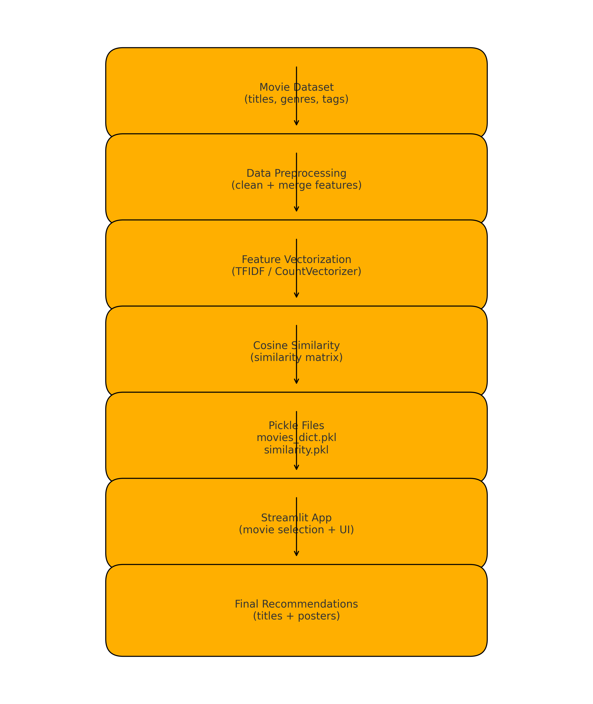
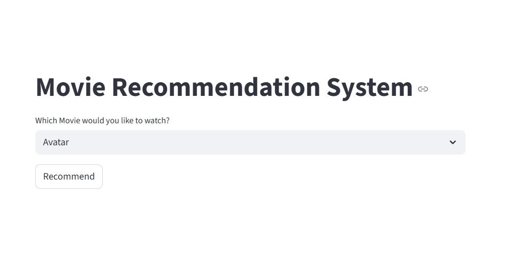
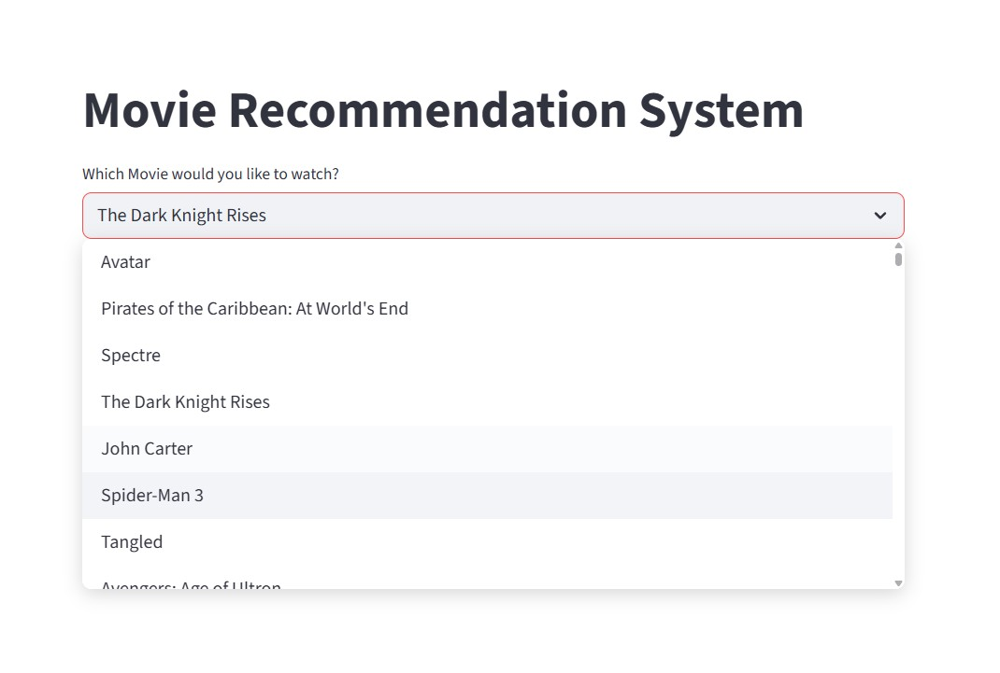

# 🎬 Movie Recommendation System

## 📌 Introduction
A content-based Movie Recommendation System that suggests similar movies using cosine similarity and metadata. Built with Python, Streamlit, and TMDB API for interactive recommendations and poster retrieval.

---

## 📘 Overview
This project recommends the top 5 similar movies based on a selected movie.  
It uses preprocessed movie metadata and a similarity matrix stored in pickled files.  
A simple Streamlit interface allows users to view titles and posters instantly.

---

## 🎯 Motivation
Movie recommendation systems power platforms like Netflix, Amazon Prime, and Hotstar.  
Building this system helped in understanding real-world recommendation logic, feature extraction, data cleaning, and deploying interactive ML applications.

---

## 🏗️ Architecture

## File Structure
├── app.py
├── movies_dict.pkl
├── similarity.pkl
├── README.md
└── screenshots/
      └── movie_recommendation_architecture.png

- **movies_dict.pkl**: Metadata of movies  
- **similarity.pkl**: Precomputed cosine similarity matrix  
- **app.py**: Main Streamlit application  
- **TMDB API**: Fetches movie posters dynamically  

---

## 🎓 Learning Outcomes
- Learned how recommendation engines work  
- Implemented cosine similarity for matching movies  
- Worked with pickled models for fast loading  
- Integrated Streamlit UI with backend recommendation logic  
- Used APIs to fetch real-time movie posters  

---

## ⚙️ Technical Aspects
- Data cleaning and feature extraction from metadata  
- Vectorization of movie descriptions  
- Storage of similarity matrix using pickle  
- UI development with Streamlit  
- API integration for poster retrieval  
- Modular Python programming  

---

## 🛠️ Technologies Used
### **Languages & Tools**
- Python  
- Streamlit  
- Pickle  
- TMDB API  
- Pandas  

### **Libraries**
- `pandas` – data handling  
- `numpy` – numerical operations  
- `sklearn` – cosine similarity  
- `requests` – API calls  
- `pickle` – model persistence  

---

## 🧠 Math & Algorithms Used
- **Cosine Similarity**  
  Used to measure similarity between movie vectors.  
- **Vectorization Techniques** (CountVectorizer / TF-IDF*)  
  (*whichever you used*)  
- **Sorting & Ranking Based on Similarity Scores**

---
## 📸 Screenshots

### 🔹 Initial UI Before Recommendations

### 🔹 Movie Dropdown Selection Interface

### 🔹 Homepage & Recommendations (Iron Man)

### 🔹 Recommendations for Batman Series

